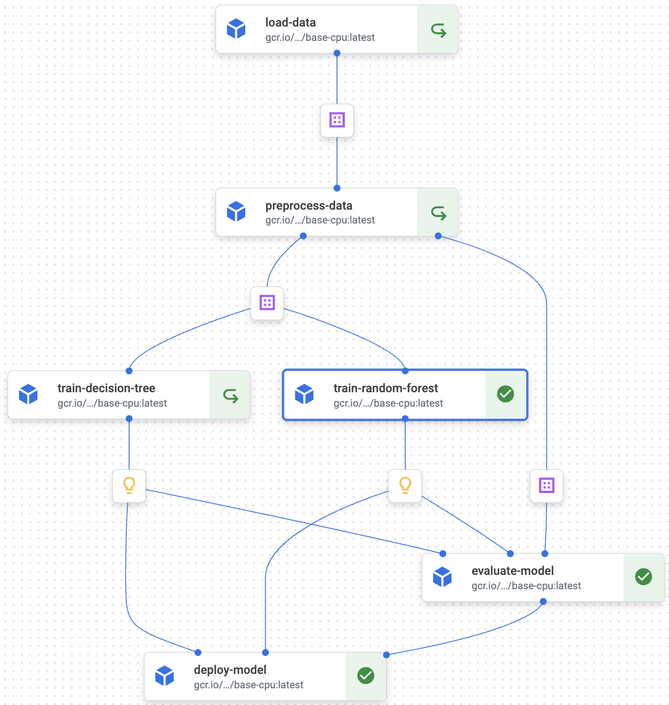

   # MLPlatform: Machine Learning Pipeline on GCP
   `MLPlatform` is a robust machine learning pipeline designed to streamline ML workflows on Google Cloud Platform (GCP) resources. Following best practices in MLOps and DevOps, it offers a structured and efficient approach to managing data loading, preprocessing, model training, evaluation, and deployment.

   ## Key Features
   * Kubeflow Pipeline: For data loading, preprocessing, model training, evaluation, and deployment.
   * Pytest: Automated component testing to ensure robustness.
   * Makefile: Streamlining task execution for efficiency.
   * Precommit Hook: For commit validation checks.
   * GitHub Actions: Automating the CI/CD workflow.
   * Poetry: Dependable dependency management.
   * Docstring and Static Typing: For readability and automated documentation generation (e.g., using Sphinx).
   * Modular Design: To maintain a clear separation of concerns and flexibility.

   ## Pipeline Visualization

   Below is a visualization of the MLPlatform pipeline components as executed on Vertex AI:

   

   The diagram illustrates the sequential and parallel processing of tasks within the pipeline:

   - `load-data`: Fetches and loads data into the pipeline.
   - `preprocess-data`: Processes the loaded data, preparing it for training.
   - `train-decision-tree` and `train-random-frost`: Train two separate models in parallel.
   - `evaluate-model`: Evaluates both models and selects the best performing one.
   - `deploy-model`: Deploys the chosen model to a Vertex AI endpoint for serving.

   Each component runs in a containerized environment, ensuring isolation and scalability.
   ## Project Structure

   ```graphql
   mlplatform_project/
   │
   ├── components/               # Pipeline components (data load, preprocess, train, etc.)
   │   ├── load_data.py
   │   ├── preprocess_data.py
   │   ├── train_decision_tree.py
   │   ├── train_random_forest.py
   │   ├── evaluate_model.py
   │   └── deploy_model.py
   │
   ├── config/                   # Configuration files and settings
   │   ├── __init__.py
   │   └── config.py
   │
   ├── notebooks/                # Jupyter notebooks for demonstrations and experiments
   │   └── mlplatform.ipynb
   │
   ├── tests/                    # Test scripts for pipeline components
   │   └── test_mlpipeline.py
   │
   ├── mlpipeline.py             # Main pipeline script
   ├── pyproject.toml            # Project dependencies and configurations
   ├── poetry.lock               # Poetry lock file for dependencies management
   ├── Makefile                  # Makefile for easy execution of tasks
   └── README.md                 # Project overview and documentation
   ```
   ## Installation

   1. Clone the Repository:

      Clone the `mlplatform` repository to your local machine.

   ```bash
   git clone git@github.com:kbakande/MLOPS.git
   cd mlplatform_project
   ```

   2. Install Python:

      Ensure you have Python >= 3.9 installed. You can download it from [python.org](https://www.python.org/).

   3. Install Dependencies:

      Use [Poetry](https://python-poetry.org/) for managing Python dependencies:

      ```bash
      poetry install
      ```

   ## Usage
   The project includes a Makefile for easy execution of tasks:

   * Run the ML Pipeline:

   ```bash
   make run_pipeline
   ```

   * Run Tests:

   ```bash
   make run_tests
   ```

   * Clean Temporary Files:

   ```bash
   make clean
   ```

   * Display Help Information:

   ```bash
   make help
   ```

   ## CI/CD with GitHub Actions

This project uses GitHub Actions for automated testing, building, and deploying to Vertex AI. The workflow, defined in `.github/workflows/main.yml`, includes:

- **Code Checkout**: Retrieves the latest code from the main branch.
- **Google Cloud Authentication**: Uses service account keys for secure access to GCP services.
- **Dependency Installation**: Sets up the environment and installs dependencies with Poetry.
- **Pipeline Operations**: Compiles and deploys the ML pipeline to Vertex AI.

The workflow triggers on push to the main branch or can be manually executed, ensuring consistent and reliable deployment processes.

## Setting Up Google Cloud Platform (GCP) Services

To run and deploy the `MLPlatform` pipeline, you need to set up several services on Google Cloud Platform. Follow these instructions to configure the required GCP services:

### Prerequisites

1. **Google Cloud Account**: Ensure you have a Google Cloud account. If you don't have one, you can [sign up here](https://cloud.google.com/).

2. **Google Cloud Project**: Create a new project or select an existing project in the [Google Cloud Console](https://console.cloud.google.com/).

### Required Services and Configurations

1. **Enable APIs**: Make sure the following APIs are enabled for your project:
   - AI Platform Training & Prediction API
   - Compute Engine API
   - Container Registry API
   - You can enable these APIs in the [APIs & Services Dashboard](https://console.cloud.google.com/apis/dashboard).

2. **Service Account**: Create a service account with the necessary permissions to access the required services. Assign roles that include permissions for AI Platform, Compute Engine, and any other services your pipeline interacts with.
   - Navigate to [IAM & Admin > Service Accounts](https://console.cloud.google.com/iam-admin/serviceaccounts) in the Google Cloud Console.
   - Create a new service account and grant it the necessary roles.
   - Generate and download a JSON key file for this service account. This file will be used for authentication in your CI/CD pipeline.

3. **Storage Bucket**: Create a Google Cloud Storage bucket to store pipeline artifacts and data. This bucket will serve as the `PIPELINE_ROOT`.
   - Go to the [Cloud Storage Browser](https://console.cloud.google.com/storage/browser) in the Google Cloud Console and create a new bucket.

4. **Set up Vertex AI**: If you're using Vertex AI, ensure that it is set up and configured in your project. Visit the [Vertex AI section](https://console.cloud.google.com/vertex-ai) in the Google Cloud Console.

5. **Configure GitHub Secrets**: Add the service account JSON key and other necessary configuration values (like project ID, bucket name, etc.) as secrets in your GitHub repository to use them in GitHub Actions.

### Using the GCP Services in the Project

Once the GCP services are set up, update the project's configuration files and environment variables to match your GCP settings. Ensure the paths, project IDs, bucket names, and other GCP-specific values are correctly set.


   ## Dependencies

      Key Python libraries and frameworks used in this project:

   * Pandas
   * NumPy
   * Scikit-learn
   * XGBoost
   * LightGBM
   * Google Cloud AI Platform
   * Pytest for testing
   * Kubeflow Pipelines (KFP)

   ## Author
   [Kabeer Akande](https://www.linkedin.com/in/koakande/)
